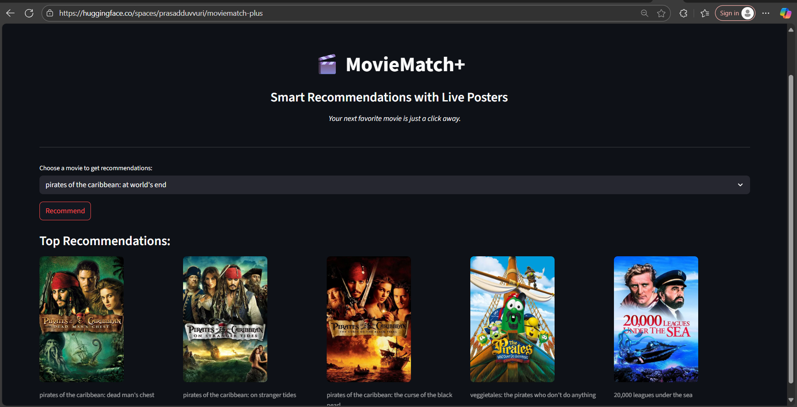
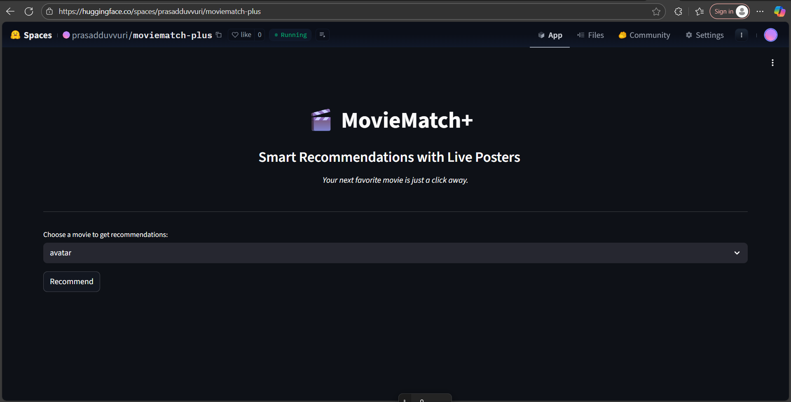

# Movie Recommender System with Live Posters- 🎬 MovieMatch-Plus 
*Your next movie night, algorithmically curated.*

[](https://www.python.org/)  
[](LICENSE)  
[](https://dvc.org/)  
[](https://huggingface.co/spaces/prasadduvvuri/moviematch-plus)  

---

## Building a Production-Ready Movie Recommender System with MLOps

Building a movie recommender is a textbook ML project — but most implementations stop at the algorithm, rarely addressing the real needs of production: reliability, reproducibility, automation, and scalability.  
This project bridges that gap by blending a proven content-based recommendation engine with modern MLOps practices to deliver a truly production-ready solution.

---

## Introducing: 🎬 MovieMatch-Plus

To give the system a unique identity, I've branded it **MovieMatch-Plus** — a containerized, versioned movie recommendation engine built for scale.  
It goes far beyond the typical portfolio demo:  
- Built for reproducibility  
- Designed for explainability  
- Ready for deployment  

You can try it live, explore the code, or fork it for your own use:  

- **Try the Live App:**  
  [https://huggingface.co/spaces/prasadduvvuri/moviematch-plus](https://huggingface.co/spaces/prasadduvvuri/moviematch-plus)  
- **GitHub Repository:**  
  [https://github.com/Duvvuridurgaprasad28/Movie-Recommender-System-](https://github.com/Duvvuridurgaprasad28/Movie-Recommender-System-)  
- **Read the full Medium blog post:**  
  [Building a Production-Ready Movie Recommender System with MLOps](https://medium.com/@durgaprasad_47163/building-a-production-ready-movie-recommender-system-with-mlops-3b99329a961b)  

---

## MovieMatch+ in Motion: 
> How metadata, vector similarity, and Streamlit deliver real-time recommendations.

This project is a content-based movie recommender system that suggests movies similar to a selected movie using metadata features and cosine similarity. The recommendations are enhanced with live movie posters fetched dynamically from the TMDB API, all presented via a Streamlit web app.

---

## Why Most Recommenders Don't Scale

Typical tutorials follow this formula: load data → train a model → show results → finished. But real-world systems require more:  
- **Reproducibility:** Can the pipeline be rerun reliably next month, or by another team?  
- **Portability:** Can it deploy seamlessly in a new environment?  
- **Automation & Control:** Are updates, versions, and rollbacks effortless and safe?  
- **Testability:** Is every step modular and easy to debug?  

This system treats the recommender as a maintainable product, not just a one-off demo.

---

## What Sets This Project Apart

### Content-Based Filtering, Built for Production  
- **Metadata Fusion:** Combines genres, keywords, cast, crew, and overviews.  
- **Text Processing:** Cleaning, lemmatization, and CountVectorizer build informative feature vectors.  
- **Cosine Similarity:** Instantly finds thematically related movies.  
- **Precomputed Matrices:** Delivers sub-200ms response time for a seamless user experience.  
- **Cold Start Solved:** Works without requiring user data.  

### MLOps-Enabled Infrastructure  
- **Data & Model Versioning (DVC):** Tracks datasets and models for full reproducibility and audit trails.  
- **Modular Pipelines:** Isolates ingestion, feature engineering, training, and serving for rapid testing and upgrades.  
- **Containerization (Docker):** Ensures the same environment from dev to deployment — no "works on my machine" surprises.    
- **Interactive UI (Streamlit):** Clean, responsive frontend with live movie posters via the TMDB API.  

---

## Project Structure

The MovieMatch+ repo is designed for clarity, reproducibility, and modularity — built with real-world collaboration in mind.

```bash
MovieMatch-Plus/
├── data/                     # Raw and processed datasets
├── artifacts/                # Serialized models and similarity matrices
├── src/
│   ├── components/           # Core pipeline scripts:
│   │   ├── data_ingestion.py         # Load and clean metadata
│   │   ├── feature_engineering.py    # Build tags, vectorize text
│   │   └── model_trainer.py          # Compute similarity matrix
│   └── app.py                 # Streamlit UI for movie recommendation
├── config/
│   ├── config.yaml           # File paths and directory settings
│   └── params.yaml           # Model parameters (e.g. top_n, stopwords, vectorizer size)
├── logs/                     # Debugging and execution logs
├── dvc.yaml                  # DVC pipeline definition (for reproducibility)
├── requirements.txt          # Python dependencies
````

---
## Demo

🎬 Explore movie recommendations with posters in an interactive UI.

---
## App Preview

### Visual Comparison

**Left:** Rich, poster-enhanced recommendations powered by TMDB API.  
**Right:** Text-only fallback UI for environments without image support.

> **Built with UI adaptability in mind — from high-fidelity visuals to minimalist text mode, the app scales across devices and API conditions.**

### ▶️ With Live Posters
The app dynamically fetches movie posters using the TMDB API for a visually rich experience.



### ▶️ Without Posters
Fallback UI showing text-only movie titles, optimized for environments without image fetching or limited resources.



---
## Features

- **Content-based filtering** using movie tags derived from genres, cast, crew, keywords, and overview.
- **Text preprocessing** including tokenization, lemmatization, and vectorization.
- **Similarity computation** using cosine similarity.
- **Live fetching** of movie posters using TMDB API.
- **User-friendly interface** built with Streamlit.

---

## Getting Started

1. **Clone the repo**

```bash
git clone https://github.com/Duvvuridurgaprasad28/Movie-Recommender-System-.git
cd Movie-Recommender-System-
```

2. **Create and activate a virtual environment**

```bash
python -m venv env
source env/bin/activate     # On Windows: env\Scripts\activate
```

3. **Install dependencies**

```bash
pip install -r **requirements.txt**
```

4. **Configure TMDB API key**

Add your TMDB API key in `**src/app.py**` (replace placeholder):

```python
TMDB_API_KEY = "your_api_key_here"
```

Sign up here: [TMDB API](https://www.themoviedb.org/documentation/api)

5. **Run the pipeline**

Use DVC to reproduce pipeline stages:

```bash
dvc repro
```

Or run stages manually:

```bash
python src/components/data_ingestion.py
python src/components/feature_engineering.py
python src/components/model_trainer.py
```

6. **Launch Streamlit app**

```bash
streamlit run src/app.py
```

---

## Real-World Impact

* **Fast, Relevant Results:** Recommendations in under a second for any movie—using only metadata.
* **Explainability:** Thematic matches make intuitive sense.
* **Maintenance-Ready:** Easily version-controlled, containerized, and redeployable.
* **Usable Interface:** Modern UI lets users explore inputs and visual results instantly.

---

## Limitations and Lessons

No system is perfect — transparency here shows real-world engineering maturity:

* Surface-Level Semantics: CountVectorizer cannot capture deep language meaning.
* No Personalization (Yet): Same output for all users per movie.
* Language Support: Currently English-only.

> These aren't weaknesses — they're launchpads for continuous improvement.

---

## Challenges & Opportunities

* Surface-Level Semantics: CountVectorizer captures basic themes but not deep meaning (short-term fix).
* No Personalization Yet: One-size-fits-all recommendations (mid-term goal).
* English-Only: Limits audience reach (long-term plan).

---

## Roadmap: What's Next

* **Semantic Matching with Sentence-BERT \[Short-Term]**
   Replace CountVectorizer with Sentence-BERT to capture deeper, conceptual relationships in movie plots—moving beyond simple keyword matching.

* **Personalized Recommendations \[Short-Term]**
   Incorporate user profiles and watch history to deliver tailored suggestions, evolving from pure content-based to hybrid recommendation models and boosting engagement.

* **Explainable AI (XAI) \[Medium-Term]**
   Leverage large language models to generate natural-language explanations answering "Why was this movie recommended?"—enhancing transparency and user trust.

* **Multimodal Feature Integration \[Medium-Term]**
   Combine metadata with visual and audio features (posters, trailers, subtitles) for richer representations and improved similarity calculations.

* **Production-Grade REST API \[Long-Term]**
   Develop a scalable, monitored API backend with version control, logging, and analytics—ready for containerized deployment and scale via cloud platforms like AWS or GCP.

---

## 🔍 Use Cases

* **Movie Discovery Apps:** Enhance user engagement by surfacing thematically similar titles
* **Content Platforms:** Power dynamic playlists and recommendations without user data
* **ML Portfolio:** Showcase a full MLOps pipeline blending reproducibility, scalability, and UI
* **Educational Tool:** Learn end-to-end ML system design with real-world tech stack

---

## Key Takeaways

* ML isn't just about algorithms—it's about infrastructure, automation, and user experience.
* MLOps is the differentiator between portfolio demos and products teams can rely on.
* System-building is the skill organizations actually need.

---

## The Bottom Line

Anyone can build a model. Few can ship a system.
By embedding MLOps from day one, this project takes a familiar ML concept and turns it into a real-world, scalable product—the kind hiring managers and organizations actually look for.

**Built it. Shipped it. Ready to scale it with your team.**

---

*For full details and blog post, visit:*
[https://medium.com/@durgaprasad\_47163/building-a-production-ready-movie-recommender-system-with-mlops-3b99329a961b](https://medium.com/@durgaprasad_47163/building-a-production-ready-movie-recommender-system-with-mlops-3b99329a961b)

*Try the live app:*
[https://huggingface.co/spaces/prasadduvvuri/moviematch-plus](https://huggingface.co/spaces/prasadduvvuri/moviematch-plus)

---

### License

This project is licensed under the MIT License.

```

---

                                             Enjoy discovering your next favorite movie! 🍿🎥
